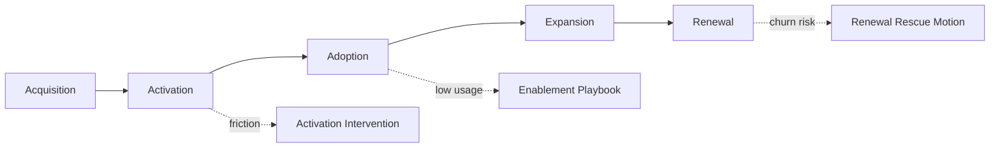
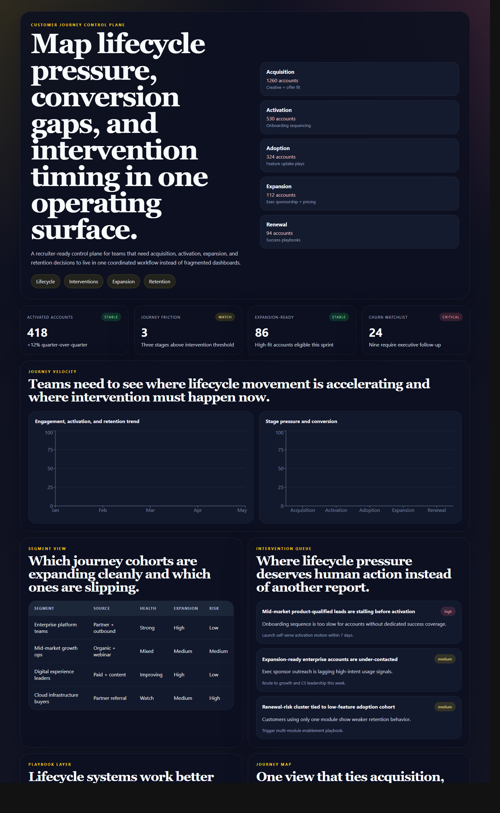
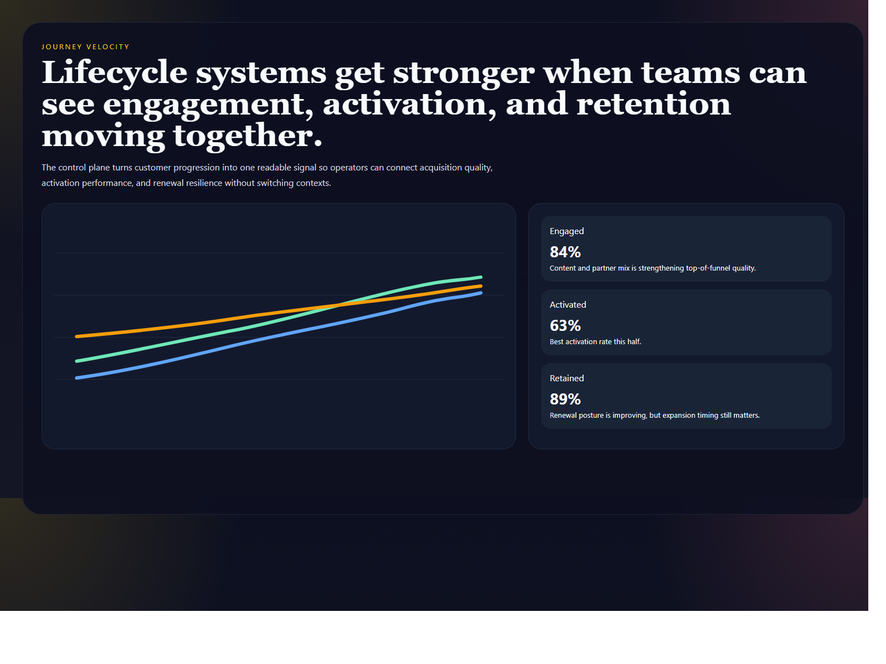
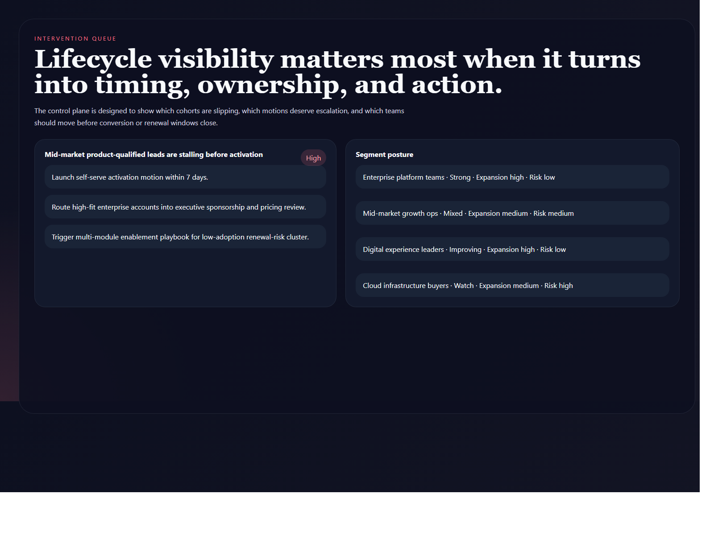
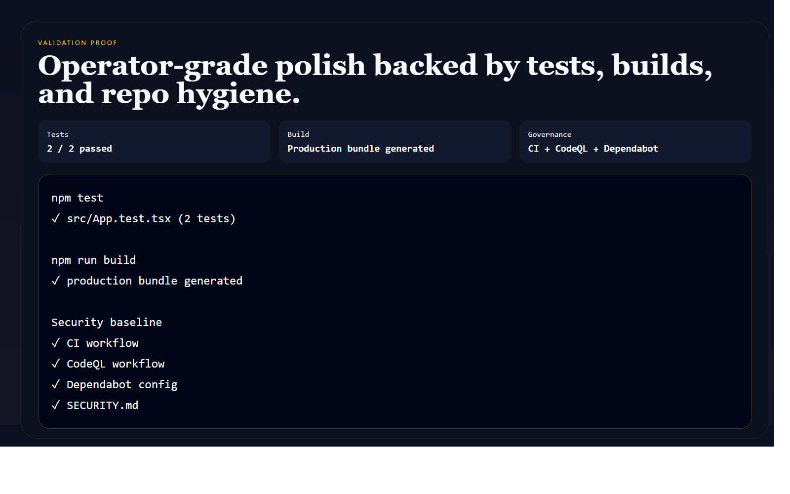

# Customer Journey Control Plane

> **React + TypeScript portfolio project** demonstrating lifecycle orchestration, intervention timing, cohort visibility, expansion prioritization, and operator-grade customer journey systems design.

**Recruiter takeaway:** *"This person understands customer journeys as operating systems, not marketing slides."*

---

## Project Overview

| Attribute | Detail |
|---|---|
| **Frontend Stack** | React 19 + Vite + TypeScript |
| **Domain** | Customer journey orchestration, lifecycle pressure, interventions |
| **Audience** | Growth teams, RevOps, customer success, leadership, lifecycle operators |
| **Signal Areas** | Activation · adoption · expansion · renewal · churn risk |
| **Portfolio Role** | Frontend lifecycle control-plane flagship |
| **Validation** | Vitest + Testing Library |

---

## Executive Summary

Customer Journey Control Plane is a recruiter-ready lifecycle command surface for teams that need acquisition, activation, adoption, expansion, and renewal to live inside one coordinated operating system. Instead of burying the customer journey across reporting tabs, it turns stage pressure, segment performance, and intervention timing into one readable surface.

It is built to show that growth and customer lifecycle work gets stronger when journey systems are treated like product infrastructure.

---

## Business Problem

Most journey reporting is too passive. Teams can see conversion or churn after the fact, but they cannot easily see where lifecycle pressure is building, which cohorts need intervention, and who should act now. Revenue, growth, and customer-success leaders need one surface that turns journey visibility into execution.

---

## Solution

This control plane creates one lifecycle product surface for:

- stage-level journey visibility
- conversion and retention trend monitoring
- segment performance comparison
- intervention queue prioritization
- playbook ownership and timing
- expansion and churn pressure visibility

---

## Architecture

```text
Lifecycle datasets and segment signals
    |
    v
Static TypeScript data model
    |
    v
React lifecycle control plane
    |
    +--> signal cards
    +--> journey trend charts
    +--> segment table
    +--> intervention alerts
    +--> playbook layer
    +--> lifecycle map
```

### Journey Flow



### Workspace Flow

1. Operators land on one surface that shows lifecycle pressure, stage velocity, and expansion readiness.
2. Journey charts expose where activation and retention are improving or slipping.
3. Segment tables reveal which cohorts are healthy, mixed, or at risk.
4. Intervention cards show where operators need to move now.
5. Playbook and journey-map views keep lifecycle action tied to ownership, not just dashboards.

---

## Screenshots

### Hero Capture



### Lifecycle Trend View



### Intervention and Segment View



### Validation Proof



---

## Key Design Decisions

| Decision | Rationale |
|---|---|
| **Lifecycle control-plane framing** | Makes the repo feel like operating software, not a funnel report |
| **Intervention-first language** | Keeps the product grounded in execution and ownership |
| **Segment + playbook pairing** | Connects cohort health to actual next actions |
| **Distinct lifecycle palette** | Gives the project a visual identity different from AI, security, and revenue tools |
| **Mermaid flow docs** | Keeps journey logic legible in GitHub itself |

---

## What An Engineering Leader Sees Here

- frontend systems design mapped to lifecycle operations
- strong translation of growth and retention complexity into product structure
- operator-facing thinking that sits between marketing, revenue, and CS
- portfolio breadth across dashboards, workflows, AI ops, and business systems

---

## Getting Started

### Prerequisites

- Node.js 20+
- npm

### Setup

```bash
git clone https://github.com/mizcausevic-dev/customer-journey-control-plane.git
cd customer-journey-control-plane
npm install
cp .env.example .env
npm run dev
```

Open:

- `http://localhost:5173`

### Run Tests

```bash
npm test
```

### Build

```bash
npm run build
```

---

## What This Demonstrates

- lifecycle systems thinking translated into a real frontend product
- journey, intervention, and retention concepts made operationally readable
- premium UI structure with charts, tables, and playbook framing
- production-minded repo hygiene with tests and security baseline
- a portfolio angle that connects growth, customer success, and revenue execution

---

## Future Enhancements

- cohort filters by region and segment
- campaign influence overlays
- lifecycle simulation scenarios
- owner-based intervention queueing
- renewal forecast and churn watch layers

---

## Tech Stack

[](https://react.dev/)
[](https://vite.dev/)
[](https://www.typescriptlang.org/)
[](https://recharts.org/)
[](https://mermaid.js.org/)
[](https://vitest.dev/)
[](https://opensource.org/license/mit)

### Portfolio Links

- [LinkedIn](https://www.linkedin.com/in/mirzacausevic)
- [Skills Page](https://mizcausevic.com/skills/)
- [Medium](https://medium.com/@mizcausevic)
- [GitHub](https://github.com/mizcausevic-dev)

---

*Part of [mizcausevic-dev's GitHub portfolio](https://github.com/mizcausevic-dev) — demonstrating lifecycle systems thinking, operator-grade frontend design, and intervention-aware customer journey execution.*
