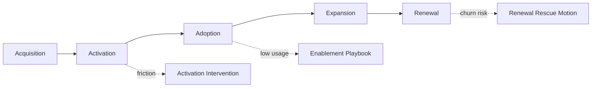

# Customer Journey Control Plane Architecture

## Service Overview

Customer Journey Control Plane is a frontend portfolio project designed to make acquisition, activation, adoption, expansion, and renewal pressure visible in one operator-grade lifecycle surface.

## Interface Flow

1. Static TypeScript datasets model journey stages, conversion trends, alerts, segments, and intervention playbooks.
2. The React application translates those datasets into a lifecycle command layer with charts, tables, and intervention views.
3. Recharts visualizations expose journey progression and stage pressure without turning the project into a reporting dump.

## Workspace Map

- `Hero`
  - positions the product as a lifecycle command surface
- `Signal cards`
  - summarize activation, friction, expansion, and churn pressure
- `Journey velocity charts`
  - show movement across engagement, activation, and retention
- `Segment view`
  - reveals how different cohorts are performing
- `Intervention queue`
  - surfaces where operator attention is needed
- `Playbook layer`
  - ties lifecycle risks to explicit owners and response windows
- `Journey map`
  - keeps the lifecycle sequence readable at a glance

## Mermaid Flow

## Design Notes

- The palette is warmer and more lifecycle-oriented than the AI and workflow control planes.
- The product is framed around intervention timing, not just stage reporting.
- Mermaid is used directly so the journey logic reads clearly inside GitHub.

## Future Upgrades

- cohort drilldowns by region
- campaign influence overlays
- lifecycle simulation mode
- success-manager ownership filters
- renewal forecast layer
